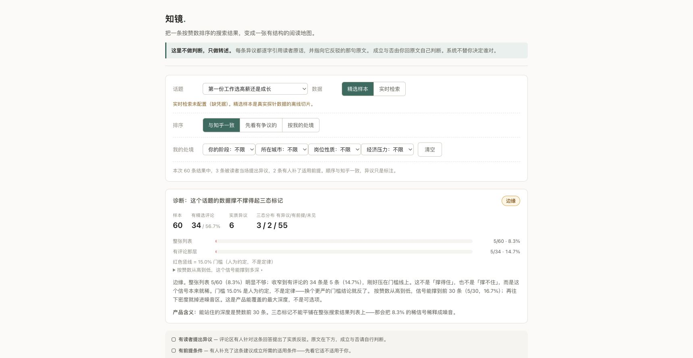
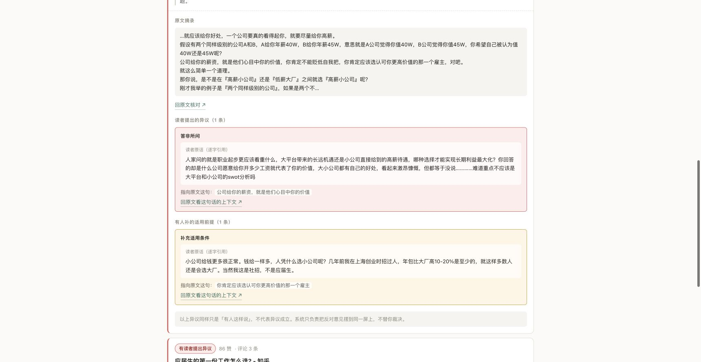
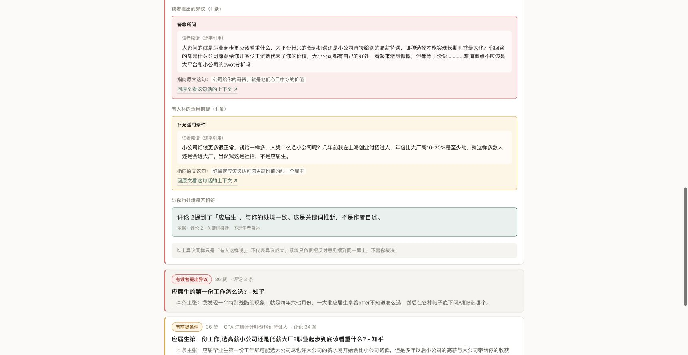
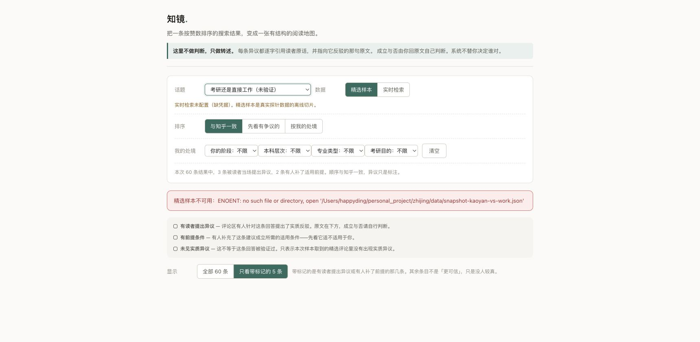
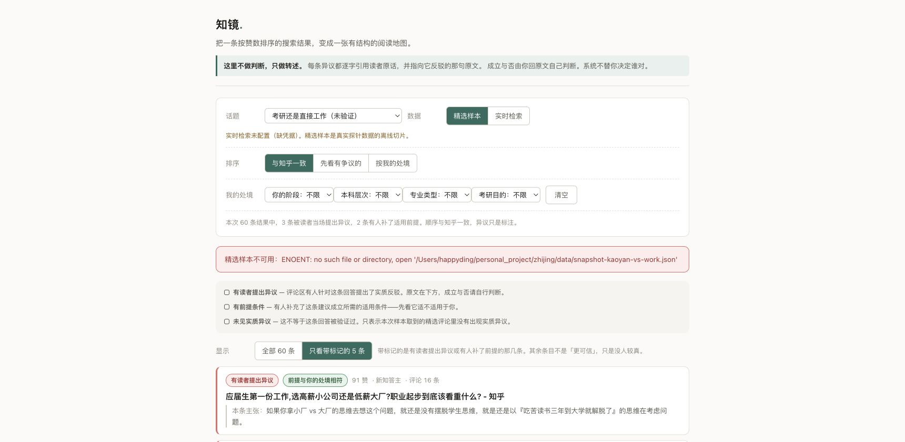

# 知镜目标与体验审查

审查日期：2026-09-12。范围：当前代码、离线样本、本机 4318 服务的桌面页面。采用产品体验审查流程，先捕获页面，再将发现与实现对应。没有修改产品代码。

## 结论

核心机制在人工标注的离线样本上已打通，完整产品目标尚未达成。可以展示真实评论与原文的对应关系，但尚不能保证用户快速找到相关异议、准确理解适用条件，或稳定完成跨话题阅读。实时自动分类未配置、未验证。

| 目标 | 当前结论 | 证据 |
| --- | --- | --- |
| 将读者异议和回答放在一起 | 离线基本实现 | 60 条回答、5 条带标记、6 条异议；展开后显示评论与原句 |
| 引用必须有原文依据 | 已实现字符串层面校验 | 检查评论索引、答案子串；不能证明两句话语义上构成反驳 |
| 不把沉默当作可信 | 文案部分实现，呈现仍有歧义 | 没取到评论和取到评论但没发现异议使用同一标签 |
| 按个人处境理解适用性 | 未达标 | “不是应届生”被标为应届生匹配；另外三个维度全部零命中 |
| 有结构且省力的阅读地图 | 部分实现 | 仍以长列表为主；异议全部折叠；诊断占据首屏 |
| 实时与跨话题使用 | 未完成验证 | liveReady=false；第二话题缺样本，第三话题明确不适用 |

## 1. 首次进入：可加载，但价值展示过晚

在本次 1720×889 截图中，首屏没有出现回答卡片。顶部介绍、控制区、诊断与图例占据全部空间。用户先遇到“标记密度”“人为门槛”“产品含义”，才有机会阅读观点。

默认前两条是住房噪音和城市选择。样本采用机械首句作为“本条主张”，不能保证它概括回答或回答当前话题。

建议：将诊断折叠到数据说明，首屏展示一个与话题有关的完整“原句—读者异议”例子；清理无关结果并重新核对主张摘录。保留完整列表入口和当前样本覆盖说明。

诊断图表的填充与阈值位置在截图中也未正确显示。代码使用 style 属性写入宽度/位置，而服务端 CSP 为 style-src 'self'，二者冲突是代码层面定位出的原因；尚未采集控制台日志单独验证。

## 2. 筛选并展开异议：核心内容可读，核对路径仍长

优点：筛选确实只显示五条带标记的记录；展开后，原文、反对意见和补充前提分别呈现，文字引用可在本地来源中找到。状态同时使用文字和颜色表达。

问题：卡片默认折叠且隐藏原生展开箭头；折叠时看不见异议摘要。展开后是长段落堆叠，原句没有在上方摘录内高亮。三处“回原文”链接实际上指向同一回答 URL，没有评论定位，用户仍须手工找评论。

卡片显示的是总评论数，不是本次取得的精选评论数。最高赞记录显示 1332 条评论，但当前来源 comments=[]，仍标为“未见实质异议”。“其余条目只是没人较真”超出了采样能够证明的范围。

建议：明确写“原站评论 1332，本次取到 0”，没取到评论显示“评论数据不足”；其他记录显示“本次取到的 N 条评论中未发现异议”。提供明显展开入口、异议预览、目标句上下文及便于原站检索的评论原文。

## 3. 选择应届生：匹配结论错误

复现：第一份工作 → 只看带标记 → 阶段选应届生 → 展开 91 赞回答。

同屏评论写“当然我这是社招，不是应届生”，下方却写“评论 2 提到了「应届生」，与你的处境一致”。折叠卡片也显示绿色“前提与你的处境相符”。

根因：src/engine.mjs:53 的 situationFit 只查作者认证和评论中是否出现选项原词；不识别否定或主体，首个命中即返回。配置的“社招 1-3 年”也匹配不到自然表达“社招”。这会把评论者的处境推广成整条建议适合读者。

对当前样本逐个选项运行同一函数：阶段能给 4/60 条记录标注；城市、岗位、经济压力两个选项各自均为 0/60。即使评论有“缺钱有缺钱的选择”，也匹配不到“要补贴家用”。界面没有无匹配反馈。

建议：优先修正或暂时取消确定性的匹配标签；将条件绑定到具体评论和主体，处理否定、同义表达与多条件冲突，无充分证据时明确未知。无信号的筛选项要显示覆盖提示。

## 4. 切换话题：存在可点击但不可用的入口

选择“考研还是直接工作（未验证）”后返回缺文件错误，直接显示 ENOENT 和完整本地路径。旧话题的“60 条、3 条异议、2 条前提”摘要、图例和筛选按钮仍在。没有明确返回可用样本的操作。

建议：接口提供每个话题的可用模式；无样本的入口显示“样本准备中”，不进入请求失败流程。错误页面使用用户能采取行动的说明，并清除旧摘要和旧筛选状态。

## 5. 报错后点击筛选：旧数据重新出现

复现：保持上一步错误 → 点击残留的“只看带标记的 5 条”。无需新请求，第一份工作的回答重新出现，而上方仍选择“考研还是直接工作”。上一轮的处境匹配标签也被恢复。

根因：public/app.js:368 的失败分支只清空诊断和列表；public/app.js:334 的旧筛选事件仍闭包持有上一轮 data，点击便重新渲染。这是用户可触发的数据一致性问题，优先级高。

建议：请求状态、当前结果及筛选由同一个当前话题/请求标识管理。切换与失败时同步清理所有结果相关区域，禁止旧处理器重新渲染旧数据。

## 额外实现核查

- 原文存在不等于异议关系正确。构造“第一份工作应该看成长。”作为答案、“我今天刚刚买了一辆自行车。”作为真实评论，模型输出 counter_example 且引用合法答案原句，verifyClassification 仍接受。此为合成诊断输入，并非真实样本中的错误标注。当前闸门保证文字来源，语义分类仍需要独立评估。
- 实时模式中每次改排序或处境都会重新请求 reading-map，服务端会再次 classify。fetch 缓存只缓存检索，不缓存分类；前端也没有实际使用 loading 状态、取消旧请求或超时处理。根据代码，可能导致等待、重复模型费用和同一批材料的标签波动。未配置实时凭据，未做付费在线复现。
- “与知乎一致”实际上是多路检索去重后的赞数降序，不能等同于知乎原搜索排序；宜改成“按赞数排序”。
- snapshot 的人工标注、机械摘句、采样时间和 caveats 元数据没有完整传到阅读地图界面。建议在数据说明中让用户看见处理方式和覆盖范围。
- 15% 是自定门槛；单份样本按每五条扫描出的前 30 条不应被表述为产品能覆盖的确定最大深度。当前只支持对本次样本的描述。

## 无障碍与证据边界

已有原生 select、button、details 以及选择控件的 aria-label，状态有文字辅助。可见问题包括大量 11–13px 浅灰字、弱化的操作提示和隐藏展开标记。代码中错误容器和结果更新没有 aria-live/role=alert。此次没有完整键盘、读屏、移动端或放大测试，不作合规结论。

当前完整 npm test 为 81/81 通过，npm run check 通过。解除本机监听限制后 HTTP 测试正常完成；上一轮的测试挂起不是本次确认的产品失败。现有测试没有覆盖本报告复现的 UI 串场和否定语义误判。

未验证真实知乎/模型调用、外部链接落地后的评论定位、移动端、真实用户是否因此节省时间。用户目标达成仍需任务测试：陌生用户能否不经讲解找出一条相关异议、说清它针对哪句话、理解样本和适用性边界。

## 建议修复顺序

先修处境误判、跨话题旧数据恢复和未取得评论的状态表达；随后收紧话题与主张质量、把一个完整异议对照放入首屏；最后完善错误/加载体验，并验证实时分类质量与用户任务效果。
