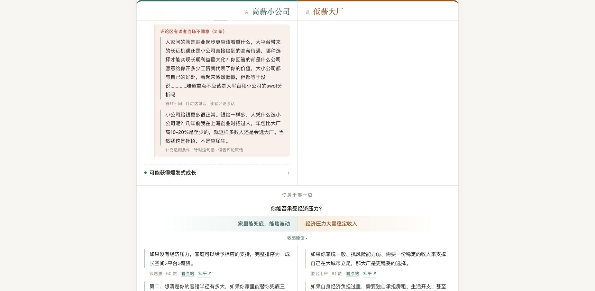
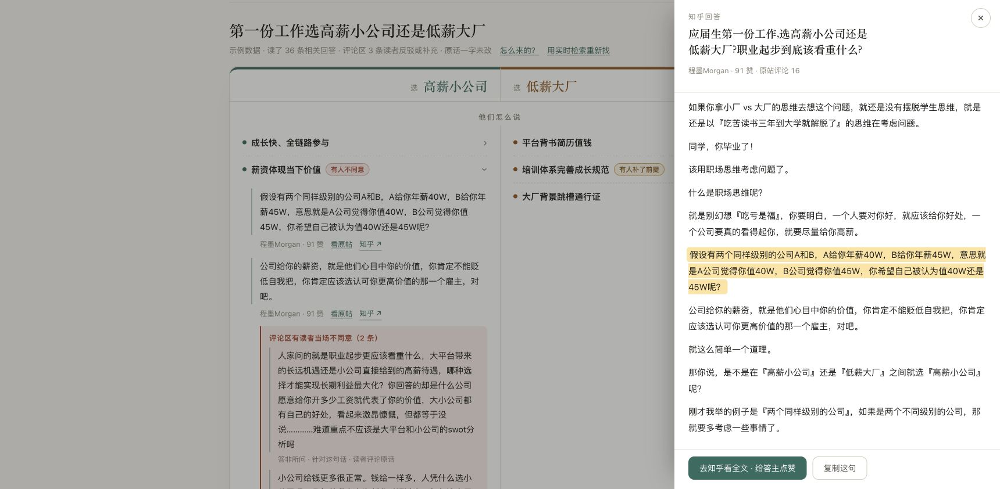

# 知镜页面与互动审查

审查对象：https://zhijing.vortotech.com/ ，本轮新开页面，桌面 Edge。辅以当前 public/index.html、app.js、style.css、session.js。未修改应用代码，未触发实时模型分析。

## 判断

当前体验更接近可展开的阅读报告。已有原话、异议和条件，但用户不能输入自己的条件并获得相应反馈。应优先建立“提出选择 → 补充情况 → 对比相关证据 → 修正理解”的流程。

## 实际步骤和证据

1. 进入页面：基本可用，但首页自动填入并展开第一份工作示例，示例身份仅以小字显示。提问入口、产品介绍和完整结果竞争首屏空间。

2. 阅读双方理由：布局需改善。默认展开左侧带异议的理由后，长评论撑高整行，右侧留下大片空白。两栏不是按相同议题对齐的比较，阅读负担集中在左栏。

3. 点击自身条件：互动缺口明显。点击条件只开合原话，不能选择自己的情况。页面底部只有更多条件、原始回答和来源说明，没有继续探索的动作。

4. 打开原帖：较好。侧栏保留主页面，署名并高亮引用，提供回知乎和复制入口。但上下文表明薪资论述以“两个同样级别的公司”为前提；归入高薪小公司理由时丢失了这个关键限制。

## 优先改善

### P0：让“你的情况”真正可操作

- 把“你属于哪一边”改为“哪些情况更接近你”，移到结果概览之后。
- 条件使用独立选择控件，提供“不确定 / 暂不回答”，与“查看依据”分开。
- 选择后显示已选条件，并将有明确证据支持的相关理由提前，说明排序变化原因；保留另一方理由和异议。
- 不把条件计数转换成胜率或替用户得出结论。没有适配证据时明确说明，不硬匹配。
- 示例：“我更看重现金流” → “先比较这两条与现金流有关的观点，并检查岗位稳定性”。
- 用户条件与当前问题绑定；切换问题不沿用旧条件。刷新和返回的保存策略需在实现时明确。

### P0：保留前提和来源关系

- 原话逐字正确，不意味着归类正确；在理由旁展示适用前提。
- 对“同级别公司比较薪资”这样的引用，补充前提标记或停止作为跨级别对比的直接支持证据。
- “有人不同意”区分反驳、补充条件，不把它们统称为证伪。
- 在理由卡提供“与我有关 / 不适用 / 想看另一种观点”。需区分个人阅读反馈和对引用错误的反馈。

### P1：把两栏长文拆成概览与证据层

- 首屏只展示双方各 2–3 个理由摘要、关键分歧，以及“结合我的情况”入口。
- 对比区不默认展开长评论；保留异议标签和短原文预览，可展开完整内容。
- 展开证据采用两栏下方的通栏区域或复用原文侧栏，避免单侧长文撑高另一侧。
- 按共同议题对齐时，只对齐实际有证据的内容；另一侧缺少材料应显示“暂无对应材料”，不能强配。
- 保留纸白、墨绿、赭色和标题字体，优先优化信息层级、字重、行距与内容密度。

### P1：区分首页与阅读状态

- 首次进入显示空输入框、清晰问题示例与简短结果预览；按钮可用“看看两边怎么说”。
- 示例入口明确“直接看示例”，避免自动填入的问题被误认为自己的输入。
- 进入结果后压缩顶部介绍，保留当前问题和“修改问题”。
- 结果底部提供“补充我的情况”“看看相反理由”“记下待确认的问题”。
- 登录旁说明实际收益，例如“登录查看收藏里的不同意见”，不把登录作为阅读门槛。

### P2：后续追问与等待反馈

- 先提供与现有证据相关的快捷追问，再考虑自由对话。追问应引用当前材料；超出材料范围时说明需要补充检索。
- 当前源码只有等待时长和取消。将来如增加阶段进度，应由真实服务端事件驱动，不能按定时器假装完成检索或校验。
- 失败时保留用户问题和条件，提供重试及示例入口。

## 可访问性与验证边界

截图可见来源说明、标签和小链接偏小偏淡；源码焦点轮廓也使用很浅的绿色。应实测对比度、键盘焦点、触控目标和读屏播报，不能据截图宣称合规。

本轮检查桌面默认示例、条件开合、原帖侧栏。未验证手机布局、登录后收藏、实时检索等待与失败、键盘全流程或读屏。没有用户行为数据，因此转化与留存收益属于待验证假设。

## 第一轮实现范围与验收

优先实现：首屏结果概览、条件选择、选择后可解释的相关证据排序、通栏证据展开。之后再做自由追问。

- 新用户能区分示例与自己的问题，并找到开始入口。
- 选择条件后有明确选中态和具体内容回应，可撤销、可跳过。
- 阅读一侧证据不会制造另一侧大片空白。
- 原话、作者、适用前提、异议及上下文可核对。
- 切换问题不混用旧条件和旧结果。
- 用可用性观察验证用户能否快速找到与自己有关的观点，而非仅统计点击量。
